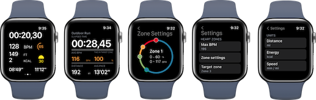

# HeartZones

Workout watchOS app optimized for runners/walkers and heart zones tracking. Build in Swift, using SwiftUI and Combine. App supports watchOS 6.0+

**Features:**

- Basic workout metrics
  - Distance
  - Active energy
  - BPM
  - Elevation gain
  - Lap pace, average pace
  - Current heart zone indicator
  - Sunset indicator
- Tracking workout route
- Heart zone notifications
  - Support for tracking target zone
- Sunset tracker
  - Count minutes until sunset, starting at 45mins
- Fully customizable heart zones
- Fully customizable metrics to shown
- Integration with HealthKit

TODO:

- Improve elevation gain algorithm calculation
- Add more workout types
- iOS app
