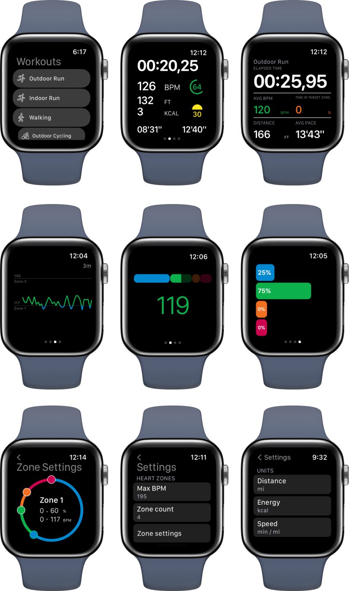

# Heart Zones Workout
Workout watchOS app optimized for runners/walkers and heart rate zones tracking. Build in Swift, using SwiftUI. App supports watchOS 6.0+ and it is available at [App Store](https://apps.apple.com/us/app/heart-zones-workout/id1578321963).

## EOL 
Project has reached its EOL, since Apple introduced heart rate zones tracking in watchOS 9 and it makes no more sense to maintain the app. Yet, it is still available at the App Store.

## Features:

- Basic workout metrics
  - Distance
  - Active energy
  - BPM
  - Elevation gain
  - Lap pace, average pace
  - Current heart zone indicator
  - Sunset indicator
- Heart rate zone graph during workout
- Heart rate zone diagram during workout
- Tracking workout route
- Customisable metrics (km/mi, kj/kcal)
- Heart zone notifications
  - Support for tracking target zone
- Sunset tracker
  - Count minutes until sunset, starting at 45mins
- Fully customizable heart rate zones
- Fully customizable metrics to shown
- Integration with HealthKit
- Read-only mode
- Customizable list of workouts
- Always-on display support
- Recover workout after app fail

### Screenshots

## TODO:
- Improve elevation gain algorithm calculation
- Add more workout types
- iOS app
